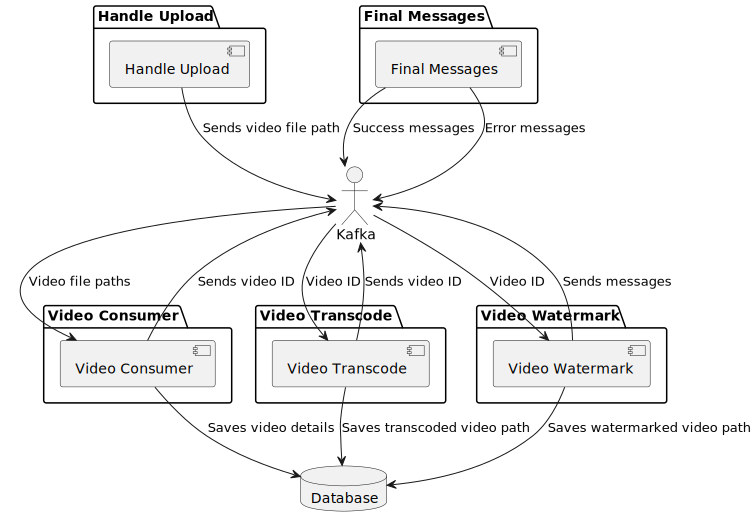

# Zebra
## Table of Contents
- [Zebra](#zebra)
  - [Table of Contents](#table-of-contents)
  - [Attention](#attention)
  - [Description](#description)
  - [Architecture](#architecture)
    - [Handle Upload](#handle-upload)
    - [Video Consumer](#video-consumer)
    - [Video Transcode](#video-transcode)
    - [Video Watermark](#video-watermark)
    - [Final Messages](#final-messages)
  - [Data Flow](#data-flow)
  - [Requirements](#requirements)
    - [Environment Variables](#environment-variables)
  - [Usage](#usage)
    - [With Docker](#with-docker)
    - [Without Docker](#without-docker)
    - [Watermarking](#watermarking)
  - [Build](#build)
  - [Contributing](#contributing)
  - [Author](#author)


## Attention
This is a study project.

## Description
Zebra is a tool designed for watermarking videos. It is built using Go and Kafka. The tool follows a producer-consumer architecture, where the video upload handler produces video file paths, and the video consumer, video transcode, and video watermark services consume the video file paths to transcode and watermark the videos. The tool uses ffmpeg to transcode and watermark the videos. The tool also uses MySQL to store the video details and AWS S3 to store the video files.

## Architecture
Zebra follows a producer-consumer architecture as illustrated in the diagram below:

[](docs/architecture_b2.svg)  
Figure 1: Draft of the architecture of Zebra

### Handle Upload
- Handles the video upload request and stores the video in a temporary file.
- Sends the video file path to the video upload topic in Kafka.

### Video Consumer
- Consumes video file paths from the video upload topic.
- Saves the video details in the database.
- Sends the video ID to the transcode service topic in Kafka.

### Video Transcode
- Consumes video IDs from the transcode service topic.
- Transcodes the video to MP4 format using ffmpeg.
- Saves the transcoded video path and URL to the database.
- Sends the video ID to the watermark service topic in Kafka.

### Video Watermark
- Consumes video IDs from the watermark service topic.
- Adds a watermark to the video using ffmpeg.
- Saves the watermarked video path and URL to the database.
- Sends success or error messages to the corresponding Kafka topics.

### Final Messages
- Sends success messages to the success topic in Kafka.
- Sends error messages to the error topic in Kafka.

## Data Flow
1. The upload handler stores the video in a temporary file and sends the file path to the video upload topic.
2. The video consumer saves the video details in the database and sends the video ID to the transcode service topic.
3. The transcode service transcodes the video to MP4 format, updates the database, and sends the video ID to the watermark service topic.
4. The watermark service adds a watermark to the video, updates the database, and sends success or error messages to the respective topics.

## Requirements
- Go 1.16
- Docker
- Docker Compose
- Kafka
- MySQL
- AWS S3 (or any other object storage)
- ffmpeg


### Environment Variables
The following environment variables are required to run the application:
This code block contains configuration settings for a project. It includes variables for MySQL, API, Kafka, and AWS Secrets. These variables are used to configure the project's database, ports, and AWS integration.

- `MYSQL_USER`: The username for the MySQL database.
- `MYSQL_PASSWORD`: The password for the MySQL database.
- `MYSQL_DATABASE`: The name of the MySQL database.
- `API_PORT`: The port number for the API.
- `KAFKA_PORT`: The port number for Kafka.
- `KAFKA_HOST`: The host address for Kafka.

AWS Secrets:
- `AWS_ENDPOINT`: The endpoint for AWS.
- `AWS_BUCKET`: The name of the AWS bucket.
- `AWS_REGION`: The AWS region.
- `AWS_ACCESS_KEY_ID`: The access key ID for AWS.
- `AWS_SECRET_ACCESS_KEY`: The secret access key for AWS.
- `OBJECTS_URL`: The URL for the objects.

These configuration settings are used to customize the behavior of the project and should be filled with the appropriate values before running the code.


## Usage
First of all, you need to create a `.env` file in the root directory of the project. You can use the `.env.example` file as a template.

### With Docker
To run the application using Docker, execute the following command:
```shell script
docker-compose up
```

This command will start the following services:
- MySQL
- Kafka
- Zookeeper
- Zebra Video Consumer
- Zebra Video Transcode
- Zebra Video Watermark
- Zebra API

### Without Docker
To run the application without Docker, you need to start the MySQL and Kafka services manually.
to start the services you must run the following commands:
```shell script
go run main.go
```
This command will start the Zebra API.

```shell script
go run cmd/video_consumer/main.go
```
This command will start the Zebra Video Consumer.

```shell script
go run cmd/video_transcode/main.go
```

This command will start the Zebra Video Transcode.

```shell script
go run cmd/video_watermark/main.go
```

This command will start the Zebra Video Watermark.

after starting the services you can use the API to upload videos and watermark them.

make a POST request to the `/upload` endpoint with the video file in the body of the request.

```shell script
curl -X POST -F "
file=@/path/to/video.mp4" http://localhost:8080/upload
```

this will upload the video and start the watermarking process.

### Watermarking
The watermarking process is done using ffmpeg. The watermark stays 25% in each corner of the video. The watermark is a SVG image that is converted to a PNG image.
You can change the watermark image by replacing the `watermark.svg` file in the `assets` directory.

## Build
fist create a `.env.production` file in the root directory of the project. You can use the `.env.example` file as a template.

To build the project, you can use the following command:
```shell script
chmod +x build.sh
./build.sh
```

This command will create a the binary of service in the `build` directory.

to run builded services you can use the following commands:
```shell script
    ./build/main --envType=production
```
this is will start all services.


## Contributing
Pull requests are welcome. For major changes, please open an issue first to discuss what you would like to change.


## Author
- [Dinho Stork](https://github.com/dinhostork)