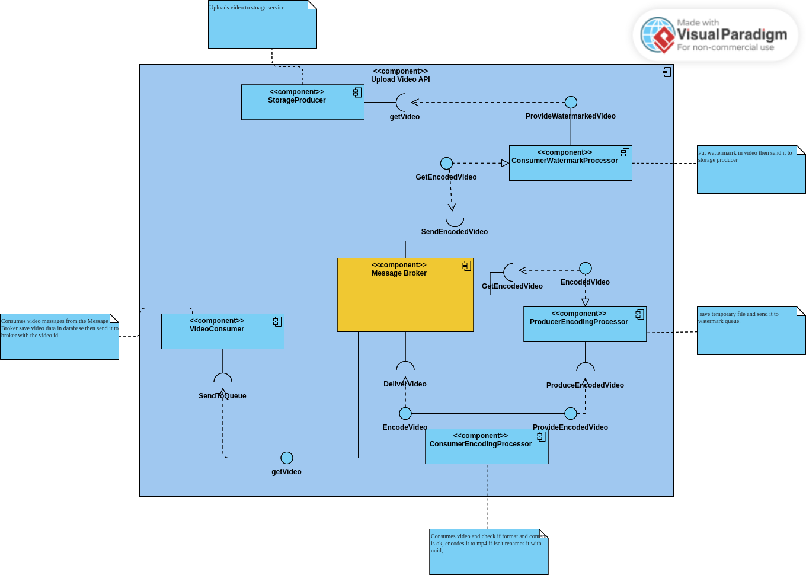

# Zebra

## Attention
This is a study project.

## Description
Zebra is a tool designed for watermarking videos using either a REST API or a messaging system. It is written in Go and utilizes ffmpeg for video processing, along with Kafka for asynchronous communication between components.

## Architecture
Zebra follows a producer-consumer architecture as illustrated in the diagram below:

[](docs/arch.png)  
Figure 1: Draft of the architecture of Zebra

### Consumer Encoding Processor
- Receives videos from Kafka.
- Checks video format and content, encodes to MP4 if necessary, and renames the video.

### Producer Encoding Processor
- Saves the temporary video file and sends it to the watermarking queue.

### Consumer Watermark Processor
- Consumes encoded videos from the queue.
- Applies watermark to videos and sends them to the next step.

### Storage Producer
- Receives watermarked videos and stores them permanently (e.g., AWS S3).

## Data Flow
1. The producer sends the video to the encoding processor.
2. The encoding processor sends the video to the watermarking queue.
3. The watermarking processor applies the watermark to the video.
4. The storage producer saves the watermarked video.

## Usage
This project can be run as api or as a messaging system.

### API
To run the API, execute the following command:
```shell script
go run main.go api
```

### Messaging System
you must have docker and docker-compose installed on your machine.

To run the messaging system, execute the following command:
```shell script 
docker-compose up
```
this is start the following services:
- zookeeper
- kafka
  
then you can run the following command to start the application:
```shell script
go run main.go messaging
```

## Configuration
The configuration is done through environment variables. The following variables are available:

STRATEGY: The strategy to be used. It can be either `api` or `messaging`. Default is `api`.


## Authors
- [Dinho Stork](https://github.com/dinhostork)